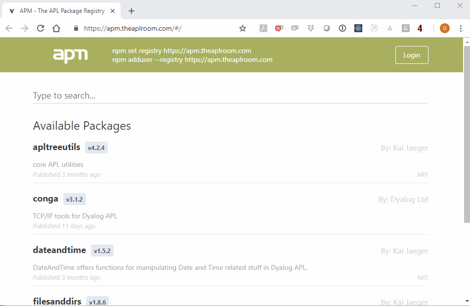

# 2 - Install a package

Now that you have your very own APM project, the next step is to try out using a public package. If you don't know what packages are available the natural step is to browse the registry or search for a suitable package using keywords. The public apm registry can be browsed on https://apm.theaplroom.com 



You can also use the command `]APM.FindPackage` to search for packages:

```
      ]APM.FindPackage date
NAME        | DESCRIPTION         | AUTHOR      | DATE       | VERSION  | KEYWORDS
dateandtime | DateAndTime offers… | =Kai Jaeger | 2018-07-25 | 1.5.2    | date time APL
```

Now to installing a package. Start off with a clean session and open your project:

```
      )clear
clear ws
      ]APM.OpenProject X:\workshop\helloapm
Opening from X:/workshop/helloapm/
 to #.HelloApm
Please wait - Reading 1 file from X:/workshop/helloapm/APLSource/
Project HelloApm opened
Current directory set to X:/workshop/helloapm/
```

Next, install the `DateAndTime` package:

```
      ]APM.AddPackage dateandtime                                
Opening from X:/workshop/helloapm/
 to #.HelloApm
Please wait - Reading 1 file from .../workshop/helloapm/APLSource
Opening from X:/workshop/helloapm/node_modules/.apm.theaplroom.com/dateandtime/1.5.2/node_modules/dateandtime/
 to #.__packages.dateandtime_1_5_2
Please wait - Reading 1 file from .../node_modules/dateandtime/APLSource
Packages: +1
+
Resolving: total 1, reused 1, downloaded 0, done

dependencies:
+ dateandtime 1.5.2
```

And check the content of the workspace:
```
      ]map
#
·   HelloApm
·   ·   AcreConfig → #.[Namespace]
·   ·   DateAndTime → #.__packages.dateandtime_1_5_2.DateAndTime
·   ·   __apm → #.[Namespace]
·   ·   quadVars
·   __packages
·   ·   dateandtime_1_5_2
·   ·   ·   AcreConfig → #.[Namespace]
·   ·   ·   DateAndTime [Class]
·   ·   ·   __apm → #.[Namespace]
```

If you compare that to what we had before the installation there is one noteable difference; the `#.__packages` namesapce in the root. This contains the dependency we just installed, `DateAndTime`. We also see a new reference in the `#.HelloApm` space:

`DateAndTime → #.__packages.dateandtime_1_5_2.DateAndTime`

This tells us that from the project space we can access the package we just installed. Try it out:

```
      HelloApm.DateAndTime.Easter 2018+⍳5
20190421 20200412 20210404 20220417 20230409
```

This reinforces the point of insulation. Our project `HelloApm` doesn't reach outside its space, but APM makes available the dependency by creating a reference to it inside the project space. So, why is that better than just loading all dependencies into the root and letting our project access them that way (eg. `#.DateAndTime.Easter 2018`)? Two main reasons:

1. Declaring dependencies is enforced

   By reaching outside the project space, you may accidentally access a package that was not declared as a dependency. If your project `A` depends on `B` depends on `C`, you could access `C` from `A` without declaring it as a dependency (simply calling `#.C`). By letting `APM` create the references (in the example `A.B → B` and `B.C → C` ), code in `A` would need to reference `C` internally (which would fail with a `VALUE ERROR`) and you reduce the risk of forgetting to declare the dependency.

2. Support multiple versions of the same package

   By nesting packages and creating references, different versions of the same package can be loaded and each dependant uses the version they require.

To see an example of point 1 above in action, install the package `filesanddirs` and then map the contents of the workspace:

```
      ]map
#
·   HelloApm
·   ·   AcreConfig → #.[Namespace]
·   ·   DateAndTime → #.__packages.dateandtime_1_5_2.DateAndTime
·   ·   FilesAndDirs → #.__packages.filesanddirs_1_8_6.FilesAndDirs
·   ·   __apm → #.[Namespace]
·   ·   quadVars
·   __packages
·   ·   apltreeutils_4_2_4
·   ·   ·   APLTreeUtils
·   ·   ·   ·   ∇ FindPathTo FormatDateTime GetOperatingSystem GoToWebPage IsChar IsDevelopment IsUnicode Last Lowercase
·   ·   ·   ·   ∇ Nest ReadUtf8File Split SplitPath Uppercase Where WriteUtf8File dlb dmb dtb
·   ·   ·   AcreConfig → #.[Namespace]
·   ·   ·   __apm → #.[Namespace]
·   ·   dateandtime_1_5_2
·   ·   ·   AcreConfig → #.[Namespace]
·   ·   ·   DateAndTime [Class]
·   ·   ·   __apm → #.[Namespace]
·   ·   filesanddirs_1_8_6
·   ·   ·   APLTreeUtils → #.__packages.apltreeutils_4_2_4.APLTreeUtils
·   ·   ·   AcreConfig → #.[Namespace]
·   ·   ·   FilesAndDirs [Class]
·   ·   ·   __apm → #.[Namespace]
```

Somewhat obscured by the amount of information, but we can see that the `HelloApm` space only has references to `DateAndTime` and `FilesAndDirs`, even though the latter itself has a references to `APLTreeUtils`.

Spend some time exploring the structure and familiarise yourself with the mechanics of the dpendencies.
